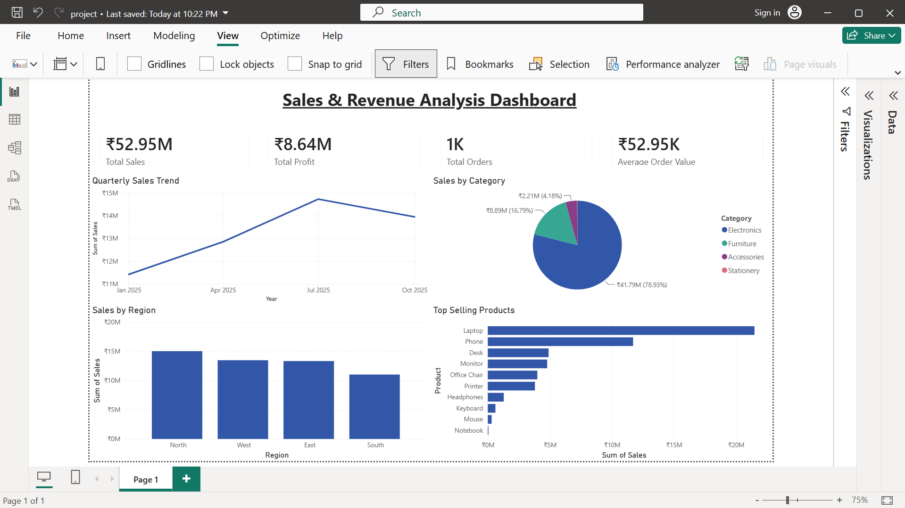

# 📊 Sales & Revenue Analysis Dashboard

## Overview

This project is an interactive Power BI dashboard developed to analyze sales and revenue performance.

## Features

- KPI Cards
  - Total Sales
  - Total Profit
  - Total Orders
  - Average Order Value

- Quarterly Sales Trend
- Sales by Region
- Top Selling Products
- Sales by Category

## Tools Used

- Power BI
- Microsoft Excel
- DAX

## Dashboard Preview

## Dataset

- Sales
- Profit
- Region
- Category
- Product
- Order Date

## Business Insights

- Analyzed ₹52.95M sales data
- Compared regional sales performance
- Identified top-selling products
- Evaluated category-wise contribution

## Author

Shubham Mallick
